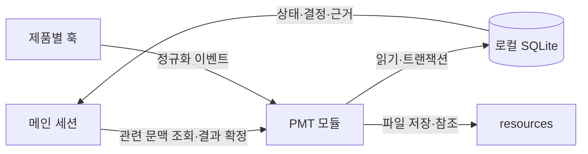

# 1단계: 로컬 저장·조회와 훅

목표는 현재 내용을 저장하고 다음 AI 세션이 필요한 범위만 읽어 작업을 이어가는 것이다. Python PMT 모듈과 CLI, SQLite, 리소스 폴더부터 구현한다.

## 처리 흐름

## 구현 범위

1. 범위별 저장·검색·재개 문맥 조회.
2. 작업 착수·점유·완료·중지와 변경 이력 기록.
3. 작업지시·응답 종료 훅을 공통 이벤트로 변환.
4. 메인 스킬을 통해 사용자 선택·결정·결과를 명시적으로 저장.
5. 리소스 ID·해시·참조·보존 기한 관리.

훅의 `Stop`은 응답 종료 이벤트다. Item을 자동으로 Done으로 바꾸지 않는다. 사용자 선택 전용 훅이 없는 제품에서는 메인이 선택 결과를 저장한다. 제품별 훅 지원과 활성화·신뢰 조건은 설치 시 확인한다. [Codex 공식 훅](https://learn.chatgpt.com/docs/hooks), [Claude Code 공식 훅](https://code.claude.com/docs/en/hooks).

## 최소 데이터 구조

| 구분 | 저장값 |
|---|---|
| 범위 | 환경·저장소·프로젝트·분류 ID, 부모 관계, 표시용 slug |
| 기록 | record ID, 종류, 제목, 상태, 본문, revision, 갱신 시각 |
| 이벤트 | event ID, 기록 ID, 세션·작성자, 시각, 변경 이유, 이전·이후 revision |
| 리소스 | artifact ID, 파일 위치, 해시, 참조 관계, 보존 기한 |

Work·Item·사실·원리·결정·파기·backlog·검증은 기록 종류로 구분한다. 필수 관계와 상태는 명시적인 필드로 관리하고, 종류별 상세 내용은 구조화된 본문에 저장한다. 전체 대화를 무조건 복제하지 않고 결정 근거가 되는 발췌·출처를 연결한다.

환경의 주 식별자는 로컬에 보관하는 고정 UUID다. IP·Hostname은 보조 정보로 사용한다. 저장소는 SSH/HTTPS 표현을 정규화한 Git remote와 고정 ID를 연결하고, 환경별 실제 경로는 별도로 둔다. slug 변경으로 참조가 끊어지지 않아야 한다.

## 문서 조회 방식

| 범위 | 생성하는 문서 |
|---|---|
| 환경 | 환경 사실, 원리와 적용 조건·증거 |
| 저장소 | 개발·배포 환경별 테스트 결과, 환경을 맞추는 README |
| 프로젝트 | 현재 결정, 파기와 이유·증거, backlog |
| Work·Item | 범위, 완료 기준, 최신 인계, 결과·검증·증거 |

공통 문서는 상세 Item과 근거를 ID로 참조한다. 결정 문서는 현재 유효한 결정만 보여주고, 철회·대체 내용은 파기 기록으로 남긴다. README의 Git 저장 여부는 선택사항이다. 재개 시 전체 이력을 통독하지 않고 관련 상태·결정·근거만 조회한다.

## 저장·점유·통신 규칙

- 통신은 로컬 명령과 stdin/stdout JSON으로 시작한다. PMT 서버는 필요하지 않다.
- DB 접근은 PMT 모듈에 모은다. 상태 변경과 이벤트 추가는 같은 짧은 트랜잭션으로 처리한다.
- 별도 `.lock` 파일의 읽기·수정 대신 DB에서 가능 여부 확인과 점유를 한 번에 처리한다.
- `event_id` 또는 `request_id`로 중복 저장을 막고, revision으로 동시 편집 충돌을 감지한다.
- 점유자·세션·작업 ID를 기록한다. 종료되지 않은 프로세스를 시간 경과만으로 재실행하지 않는다.
- 훅은 이벤트를 짧게 기록하고 반환한다. 기록 실패를 표시하고 원문 이벤트를 로컬 재전송함에 남긴다.

SQLite의 트랜잭션을 사용하되 모델 호출·테스트 실행 동안 DB 트랜잭션을 유지하지 않는다. [SQLite 공식 트랜잭션](https://www.sqlite.org/lang_transaction.html).

## 검증 기록의 기반

검증에는 대상 범위·실제 파일 상태·환경·의존성·명령·검증 정의 버전·결과·증거를 저장한다. 관련 미커밋 변경도 대상 상태에 포함한다. 다른 Item에서도 같은 검증 ID를 참조할 수 있어야 한다.

현재 조건과의 일치, 필요한 완료 기준의 포함 여부, 이후 실패·철회, 증거 보존 여부를 확인해야 재사용할 수 있다. 영향 범위를 알 수 없거나 실행 도중 대상이 바뀌었다면 재사용하지 않는다. 이 단계에서는 저장·조회 기반을 만들고 자동 재사용 판단은 이후 확장한다.

## 완료 기준

- 새 세션이 현재 상태·다음 작업·근거를 복원한다.
- 같은 훅 이벤트가 재전송돼도 기록은 한 번만 반영된다.
- 두 세션이 같은 Item에 착수하면 하나만 점유에 성공한다.
- `Stop`만 수신했을 때 Item이 Done이 되지 않는다.
- 상태와 이력이 함께 저장되거나 함께 취소된다.
- 기록·리소스를 백업하고 복원했을 때 ID와 참조가 유지된다.
