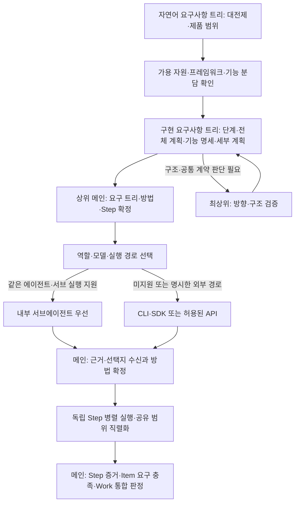

# 2단계: 모델 선정·전달·병렬 실행

1단계의 로컬 PMT 위에 모델 분배 기능을 추가한다. 상위 모델이 기본 메인을 맡고, 필요한 구조 판단은 최상위에 요청하며 확정된 Step을 하위 모델에 배정한다. 모든 작업이 세 등급을 순서대로 거칠 필요는 없다.

2026-10-01 합의 반영. 이 문서는 2단계 구현 규격이며 Step 계층·분배 기능이 이미 구현됐다는 뜻은 아니다.

## 처리 흐름

## 모델 역할과 배정 순서

| 역할 | 책임·반환 |
|---|---|
| 최상위 | 불완전한 요구의 큰 기준과 고난도 판단. 모듈 경계·기능·통신·동작 레퍼런스·데이터 책임, 기술 선택 이유, 코드 규칙·운영 로그의 저장/보존/조회·관리와 확장 제약을 결정 |
| 상위 | 기본 메인. 자연어 요구사항 트리와 구현 요구사항 트리를 연결하고 방법·작업 순서·의존성·기능 명세·Step 지시를 작성. 배정·문제 조정·결과 취합·통합 검증·문서 반영·완료 판정 |
| 하위 | 확정된 Step의 구현·수정·검증·테스트. 승인 범위의 명확한 오류는 직접 고치고 실제 산출물·시험·증거·미해결 사항 반환 |

- 신규 프로젝트는 모듈 경계와 계약부터 정한다. 필요한 폴더 tree와 검증한 프레임워크를 연결하며, 예상하지 못한 미래 기능까지 설계하거나 파일별 수정 절차를 미리 확정하지 않는다.
- 기존 프로젝트는 저장소의 구조·개발·운영 문서를 먼저 확인한다. 없으면 작성을 권유하고 관련 코드에서 확인한 범위부터 정리한다. `현재 확인된 구조 / 확정 결정 / 변경 제안`을 구분하며 문서 부족 때문에 긴급 복구를 막지 않는다.
- 하위는 입력·완료 기준이 모호하거나 자기 변경 범위를 벗어나면 상위에 요청한다. 상위는 모듈 경계·공통 계약·핵심 기술이 바뀌면 최상위에 근거·영향·대안을 제시한다. 사용자 목표·대원칙 변경은 사용자에게 제시한다.
- 상위는 구현 방법·계약 오류·테스트 이상을 조정하고 구조 문서의 관련 변경을 반영한다. 최상위의 판단도 관찰 가능한 근거와 검증 조건을 남긴다. 사용자에게 원리 설명을 반복하지 않고 요청받거나 선택이 필요한 지점만 설명한다.
- 역할과 실제 모델·코딩 에이전트·실행 경로를 분리한다. 세 등급의 모델·우선순위는 사용자 설정을 따르고 결과의 타당성은 기준과 증거로 판정한다.

1. 사용자가 실행 방식을 명시하면 그 선택을 우선한다.
2. 기본 `auto`에서는 메인과 같은 코딩 에이전트가 대상 모델·도구·권한을 지원하면 **내부 서브에이전트**를 우선한다.
3. 내부 실행이 불가능하면 제품별 외부 CLI/SDK 연결부를 사용한다. 직접 모델 API는 허용된 경우에 사용한다.
4. 내부 동시 실행 한도에 걸리면 Queue에서 기다린다. 시작된 작업을 다른 경로에 중복 배정하지 않는다.

조사·구현·검증 모두 같은 순서를 적용한다. 같은 모델 제공자라는 이유만으로 내부 지원을 가정하지 않는다. 서브 실행은 메인 세션의 네이티브 도구로 호출하고 부모-자식 실행 ID를 연결한다. 요청 모델과 실제 사용 모델이 다르면 결과에 표시한다.

제품별 모델 지정과 제약은 공식 규약을 확인한다. [Codex 서브에이전트](https://learn.chatgpt.com/docs/agent-configuration/subagents), [Claude Code 서브에이전트](https://code.claude.com/docs/en/sub-agents), [OpenCode 에이전트](https://opencode.ai/docs/agents/).

## 관리 계층과 태그

`프로젝트 → 분류 → Work → Item(요구사항 분해 트리) → Step(하위 모델 실행 내용)`으로 관리한다. Item은 하위 Item을 가질 수 있으며 Step은 실행 가능한 Item에 연결한다. Step의 재시도는 같은 Step의 새 실행 시도로 기록하고 새 요구사항이나 중복 Step을 만들지 않는다.

| 단계 | 의미 | 분류 태그 예시 |
|---|---|---|
| Work | 사용자에게 제공할 작업 목표와 통합 완료 기준 | 신규 기능·버그 수정·개선·운영·조사 |
| Item | Work를 분해한 요구사항·제약과 충족 기준 | 기능 요구·품질 요구·제약·호환성 |
| Step | 정해진 방법에 따른 구현·실험·검증 등의 실행 단위 | 조사·실험·구현·테스트·검토·문서화·통합 |

- 분류 기준은 프로젝트에 맞춰 기능·URL·모듈 등을 선택한다. 대표 분류를 정하고 겹치는 다른 관점은 참조·보조 태그로 연결한다. 이름·URL이 바뀌어도 고정 ID와 작업 관계를 유지한다.
- 태그는 분류·검색 용도다. 상태·우선순위·담당자·모델·의존성·버전·점유는 별도 필드와 관계로 관리한다. 우선순위는 기본적으로 부모에서 상속하고 변경 이유가 있으면 해당 단계에서 재지정한다.
- 단계별 태그 의미를 구분하고 프로젝트 공통 목록에서 관리한다. 부모 분류와 모든 태그를 자식마다 복제하지 않는다. 태그 추가만으로 완료·점유·검증 상태를 바꾸지 않는다.

## 문서 원본과 보관

| 자료 | 원본·책임 | 프로젝트 관리툴에 포함할 내용 |
|---|---|---|
| 저장소 구조·개발·운영 규칙 | 기존 저장소 문서를 우선 사용. 새 참조문서는 `docs/pmt-docs/`, 짧은 진입 규칙은 저장소 루트 `AGENTS.md` | 필요한 요약·참조만 |
| Work/Item의 요구·상태·결정·이력 | PMT SQLite. 상위 메인이 변경·완료를 판정 | 기존 연동 범위를 따름. 외부 도구에는 Project·Work 요약과 결정·파기 중심 |
| Step 작업지시 원문 | PMT 내부 리소스의 버전별 문서. 상위가 실행 직전에 확정 | **원문 제외**. 필요한 Step ID·부모·상태·지시서 버전·참조·결과/증거 ID만 |
| 실행 결과·검증 증거 | PMT 기록과 참조 리소스. 하위가 제출하고 상위가 적용성을 판정 | 필요한 요약·참조만 |

저장소의 장기 규칙은 Git 문서가 원본이며 PMT는 문서 버전·hash·참조를 연결한다. Step 지시 원문도 한 곳에서만 관리하고 SQLite에는 현재 지시서 참조와 관리 메타데이터를 둔다. 같은 본문을 DB·Markdown·관리툴에서 각각 수정하지 않는다. Step 지시 원문은 관리툴 화면·외부 연동에서 제외하고 실행 연결부가 참조로 읽어 필요한 범위만 모델에 전달한다.

제품별 지시문 탐색 규칙에 맞춰 루트 진입점과 참조문서를 연결한다. 링크가 있다는 이유로 전문을 읽었다고 가정하지 않고 배정 시 필요한 문서·버전을 확인한다. [Codex 규칙](https://learn.chatgpt.com/docs/agent-configuration/agents-md), [Claude 규칙](https://code.claude.com/docs/en/memory), [OpenCode 규칙](https://opencode.ai/docs/rules/).

## 요구사항·계획 규칙

트리 제작은 아래 두 과정으로 분리한다. PMT 개발의 1/2/3단계와 별개이며, 자연어 트리는 달성할 목표·범위, 구현 트리는 그 요구를 해결할 기술·기능·방법·작업 관계를 나타낸다.

### 1. 자연어 요구사항 트리 제작

| 순서 | 처리 | 남길 내용 |
|---|---|---|
| 첫 요구사항 수집 | 사용자 원문과 요청 배경·목표·제약을 수집 | 원문 참조, 해결할 문제와 완료 기준 |
| 요구사항 분리 | 단일 행동·확인 가능한 요구로 분해 | 요구 노드와 부모 관계, **분리할 때마다 해당 가지의 대전제** |
| 부족한 부분 보완 | 누락·모호함·충돌을 확인하고 필요한 내용을 채움 | 확인된 사실·미확정 사항·가정·선택 근거. 사용자 목표를 임의로 확정하지 않음 |
| prototype 범위 지정 | 핵심 동작과 원리·실현 가능성을 확인할 최소 범위 결정 | 포함/제외 요구, prototype 완료 기준과 증거 |
| 기능 확장 범위 지정 | prototype 이후 추가·고도화할 기능과 연결 범위 결정 | 추가 목표·의존 관계·우선순위·확장 완료 기준 |
| production 범위 지정 | 실제 사용·배포·운영에 필요한 범위 결정 | 대상 환경, 기능·품질·운영 요구와 production 완료 기준 |

각 가지의 대전제에는 상위 대전제 참조, 해당 범위의 판단 기준, 출처·확정 여부를 남긴다. 상위와 충돌하는 기준을 독립적으로 확정하지 않는다. 50자 제한은 트리 요약에 적용하며 원문과 판단 근거를 잃지 않는다. 후속 확장이나 특정 단계가 불필요하면 범위 없음/미적용과 이유를 명시한다.

### 2. 구현 요구사항 트리 제작

| 순서 | 처리 | 남길 내용 |
|---|---|---|
| 가용 자원 확인 | 자연어 요구를 해결할 기존 코드·문서·원리·검증, 실행 환경·도구·권한·자원 제약 확인 | 재사용 가능한 자원, 부족한 자원·미확인 조건과 적용 근거 |
| 프레임워크 선정 | 요구와 자원에 맞는 대안을 비교해 기술 선택 | 선정 이유·제약·공식 근거·필요한 실험 결과. 기존 기술 활용 여부 포함 |
| 프레임워크당 기능 지정 | 각 프레임워크가 맡을 기능·데이터 책임과 연결 경계 결정 | 원 요구 참조, 기능 분담·공유 계약·기능 중복/누락 여부 |
| 작업 단계 지정 | prototype·기능 확장·production별 구현 범위와 순서 결정 | 단계별 작업·선행 조건·의존성·확인 기준 |
| 1차 구현 계획 생성 | 전체 구조와 동작 방향을 정하고 관련 구조 판단을 최상위에 요청 | 아래 전체 계획 항목과 선택 근거 |
| 기능 명세 작성 | 기능별로 기대하는 입력·출력과 동작 확인 방법 정의 | 값의 의미·형식·제약·불변식·오류 조건, 기능 확인 Test·로깅 방식 |
| 세부 구현 계획 작성 | 확정 방법을 하위 모델이 수행할 수준까지 분해 | 실행 순서·의존성·공유 경계·자율 범위·기준별 검증과 Step 연결 |

1차 구현 계획에는 폴더 tree 구성, 포함 프레임워크, 기능별 모듈 분리 범위·각 모듈의 기능, 모듈간 통신 방식·동작 레퍼런스, 기능 확장 여지, 코드 구현 규칙, 운영 로그의 저장·보존·조회·관리 방식을 포함한다. 폴더 tree는 코드 배치 구조이며 요구 트리와 구별한다. 기존 프로젝트에서는 관련 문서·구조를 재사용하고 바뀌는 범위와 근거만 갱신한다.

기능 명세의 `목표-input / 목표-output`은 직접 값 나열이 아닌 각 값의 의미와 계약이다. Test·로깅은 무엇을 관찰해야 그 기능이 확인되는지 연결하고, 세부 계획도 파일별 추가/수정/삭제 지시 목록으로 만들지 않는다. 확인되지 않은 방법은 실험으로 분리해 증거를 얻은 뒤 구현 계획에 반영한다.

### 두 트리의 연결과 제품 단계

- 자연어 요구와 구현 노드에 고정 ID·버전을 두고 구현 노드는 해결할 자연어 요구를 참조한다. 한 요구를 여러 기능·Step이 해결하거나 한 공통 기능이 여러 요구를 지원할 수 있으며, 구현 방법 때문에 요구 원문을 복제하지 않는다.
- 자연어 요구는 Work/Item의 목표·충족 기준에 연결하고 구현 트리의 확정 실행 내용은 Step에 연결한다. 두 트리 제작만으로 관리 계층에 새로운 depth를 추가하지 않는다.
- `제품 단계`는 `prototype / 기능 확장 / production`의 별도 필드로 관리하며 두 트리의 범위·기능·Step을 연결한다. 분류 태그, 모델 등급, 작업 상태, PMT 개발 단계와 혼용하지 않는다. 같은 기능도 제품 단계별 구현 범위·확인 기준을 구분한다.
- 구현 기능에는 원 요구·가지의 대전제·제품 단계·충족 기준을 연결한다. 누락된 요구와 원 요구에 없는 범위 확장을 확인하고, 상위가 미해결 사항과 단계별 기준을 확인한 뒤 구현 Step을 배정한다.
- 대전제가 바뀌면 연결된 구현 기능·계획·Step·검증의 적용성을 확인한다. 영향 있는 가지는 활성 계획에서 제외하고 배정 중지·중단·재계획과 파기 근거를 남긴다. 영향 없는 원리·증거와 위임된 자율 결정 범위는 유지한다.
- prototype 완료는 해당 범위의 확인 결과다. 기능 확장·production 또는 전체 Work 완료는 각 범위의 요구와 증거로 별도 판정한다.

### 공통 분해·선택 규칙

- 원래 요구사항을 보존하고, 트리의 각 요약은 한 줄 50자 이내로 작성한다.
- 단일 행동까지 요구사항을 분해한 후 구현 방법을 정한다.
- 방법은 실제 가능한 대안 3개 이상을 각 30자 이내로 제시한다. 직접 작성·AI 자유 선택도 제공한다. 대안이 부족하면 허수 대신 부족함을 표시한다.
- 원리·증거가 부족한 방법은 확정 계획으로 승격하지 않고 탐색·실험 작업으로 분리한다.
- 하위 모델이 정해진 방법으로 실행할 수 있을 만큼 구체화하되, 파일별 수정 지시 목록까지 미리 작성하지 않는다.
- 대원칙 변경 시 기존 가지를 활성 계획에서 제외하고 파기 이유·증거를 보존한다. 종속 대기 작업과 진행 작업도 취소·중단·재계획한다.
- AI 자율 범위는 하위 트리에 상속한다. 그 범위의 수정은 재질문 없이 처리한다.
- 사용자에게는 선택·기준 변경이 필요한 지점만 제시한다. 설명을 요청하면 대전제·문제점·방법·필요한 원리 순으로 설명한다.
- 요구 트리의 목표와 범위로 Project·분류·Work·Item을 정하고, 구현 방법은 Step으로 연결한다. 방법 변경을 요구사항 변경으로 혼동하지 않는다.

## Step 지시와 반환 계약

상위는 기존 문서를 재사용할 수 있는지 확인한 뒤 실행 직전에 해당 Step 지시를 확정한다. 목적은 작업 이유, goal은 관찰 가능한 완료 상태다. 모든 오류에 새 BUG/TEST 문서를 만들지 않고 명세 변경·반복 실패·다른 작업에 영향을 주는 원인에 지속 기록을 남긴다. 그 기록을 근거로 수정 지시를 갱신한다.

| 지시 항목 | 내용 |
|---|---|
| 근거·버전 | 부모 Item·자연어/구현 요구·가지의 대전제·제품 단계·결정·관련 원리/증거 참조, 요구·계획·지시서 버전 |
| 목적·goal/non-goal | 이유, 완료 목표, 제외할 결과 |
| 변경 범위·경계 | 추가/수정/삭제할 기능·모듈 범위, 변경 금지와 공유 계약, 자율 결정 범위 |
| input/output | 각 값의 의미·형식·제약·불변식·실패 조건. 운영 값·비밀값 나열은 제외 |
| 방법·선행 조건 | 확정 방법과 적용 근거, 의존 작업·필요한 문맥·환경·권한 |
| 시험·로그 | 기준별 실제 확인 방법, 유효한 기존 검증의 재사용 조건, 관찰 지점·증거·오류 기록 |
| 완료·반환 | 산출물·합격 조건·부분 결과와 차단 보고 형식 |

파일별 추가/수정/삭제 절차를 지시서의 본문으로 만들지 않는다. 하위는 착수 시 실제 변경 영역과 공유 경계를 확인하고 점유한 범위에서 작업한다. 전체 공통문서를 매번 복제하거나 반복 탐색하지 않는다.

반환에는 Step/실행 ID, 사용한 지시서 버전·실제 모델/경로, 변경 요약·산출물, 기준별 pass/fail/blocked/not_run, 실제 명령·종료 코드·환경·대상 상태·증거 참조, 미해결·다음 조치를 포함한다. 모델의 성공 보고만으로 완료하지 않는다. 중요한 검증은 상위가 기준과 증거를 확인하고 필요하면 구현 담당과 다른 작업자에게 배정한다.

## 스킬과 실행 연결부

| 구성 | 담당 |
|---|---|
| 조사·실행·검증 스킬 | 역할, 지시사항, 자율 범위, 완료 기준, 결과 형식 |
| 제품별 전달 스킬 | 제품에 전달할 입력·문맥과 결과 해석 규칙 |
| 실행 연결부 | 실제 서브 호출·프로세스·SDK·HTTP 연결, 실행 ID·취소·결과 수신 |

실행 연결부는 `start / status / result / cancel`로 통일한다. 스킬만으로 실제 호출 기능이 생긴다고 가정하지 않는다.

| 외부 연결이 필요할 때 | 초기 방식 |
|---|---|
| Codex | `codex exec --json`과 구조화된 결과 수집. [공식 문서](https://learn.chatgpt.com/docs/non-interactive-mode) |
| Claude Code | `claude -p --output-format json` 또는 SDK. [공식 문서](https://code.claude.com/docs/en/headless) |
| OpenCode | 선택 버전의 로컬 HTTP 서버·SDK. [공식 문서](https://opencode.ai/docs/server/) |
| 직접 모델 API | 제공자 HTTPS API로 조사·선택지 생성부터 지원. 코드 작업은 도구 실행 기능을 연결한 뒤 활성화 |

에이전트·제공자·모델·인증 방식은 별도로 설정한다. ChatGPT 로그인 기반 Codex 사용과 OpenAI API 직접 호출은 구분한다. freeLLMAPI 등 추가 연결은 실제 제공자·규격·도구 지원을 확인한다. 직접 API를 끄는 설정이 에이전트 자체의 모델 통신까지 끄는 것은 아니다.

## 요청·실행·반환

| 구분 | 최소 내용 |
|---|---|
| 요청 | request_id, parent_run_id, work/item/step ID, role, agent, model, connection_mode, skill_version, 지시서 참조·버전·hash, 요구/계획 버전, context_refs, workspace, 허용 범위, 완료 기준 |
| 실행 | job_id, run_id, native_subagent_id, 실제 경로·모델, 상태, 시작·종료 시각 |
| 결과 | 요약, 선택지·근거 또는 변경·검증 결과, evidence_refs, 오류 |

`connection_mode`는 `auto / subagent / cli / api`로 구분하며 `cli` 경로는 SDK 연결도 포함한다. 자격 증명은 로컬에 별도 보관한다.

요청 Queue와 실행 상태는 로컬 PMT에 저장한다. 지시 원문을 Queue 기록에 다시 복제하지 않고 고정된 참조로 읽는다. 하위 모델에는 필요한 문맥·범위·완료 기준을 명시적으로 전달한다. 작업 공간을 분리하고 같은 파일·공유 배포 대상의 충돌은 직렬 처리한다.

결과는 완료 순서대로 수집하고 PMT에 보존한 뒤 메인에 반환한다. 네이티브 반환, 대기 호출·로컬 콜백 또는 run_id 결과 조회를 사용한다. 메인이 닫혀도 다음 세션에서 결과를 조회할 수 있어야 한다. 닫힌 세션을 자동으로 깨우는 기능은 필수가 아니다.

실패·시간 초과·형식 불일치는 failed/blocked로 보고하고 메인이 재시도를 판단한다. 유효한 기존 검증은 적용 조건을 확인해 재사용하고, 병렬 변경을 합친 상태의 검증은 별도로 판단한다.

## 점유·변경·완료 판정

- 기본 실행 점유는 Step 단위다. 같은 Item의 독립 Step은 병렬 실행할 수 있지만 공유 변경 범위의 충돌도 확인해야 한다. Item은 메인의 요구 충족·결과 취합 단위이며 부모 점유로 모든 자식 실행을 막거나 자식의 소유권을 우회하지 않는다.
- Step 완료는 지시된 실행과 증거, Item 완료는 요구 충족, Work 완료는 통합 결과와 전체 기준으로 판정한다. 모든 Step이 끝났다는 이유만으로 Item/Work를 자동 완료하지 않는다.
- 요구·계획·지시서 버전은 업무 상태 변경용 revision과 구별한다. 대원칙 변경 시 해당 가지의 대기 배정을 막고 진행 작업의 중단을 확인하며 기존 결과를 기록한다. 오래된 지시의 반환은 보존하되 현재 계획을 완료시키지 않는다. 사용자 위임 범위의 방법 변경은 재질문 없이 관련 Step·문서를 갱신한다.
- 현재 1단계의 Work/Item 점유·완료·검증 계약을 Step 실행에 맞춰 확장해야 한다. 기존 데이터의 관계·점유·완료 의미를 보존하는 이관, 부모 집계, 증거 적용 범위와 취소 후 늦은 반환을 함께 검증한다. 단순히 태그나 문서 폴더만 추가하지 않는다.

## 긴급 작업

실서비스 문제는 최소 증거를 남기며 허용 범위에서 복구를 우선한다. 이후 원인 재현 → 원리·근거 확인 → 재발 방지 계획 → 수정·회귀 테스트 → 지식 갱신을 같은 이력으로 연결한다. 서비스 회복과 근본 원인 해결은 별도 완료 기준으로 관리한다.

## 완료 기준

- 같은 에이전트의 지원 모델은 서브 경로로 실행된다.
- 미지원 조합과 명시한 외부·API 경로를 구분한다.
- 조사 결과가 선택지·근거 형식으로 메인에 반환된다.
- 자연어 요구를 분리할 때마다 대전제가 기록되고 prototype·기능 확장·production 범위와 확인 기준이 구분된다.
- 자원 확인·프레임워크/기능 분담·전체 계획·기능 명세·세부 계획이 원 요구에 연결되며 누락·과도한 확장·미확정 조건을 확인할 수 있다.
- Work/Item/Step 관계와 태그·필드·상속 규칙이 유지되고 관리툴에 Step 지시 원문이 포함되지 않는다.
- 배정한 지시서·요구/계획 버전이 재개 후에도 확인되며 범위 안의 오류 수정과 상위 판단 요청이 구분된다.
- 확정된 Step만 점유·병렬 실행되고, 메인이 Step 증거·Item 요구 충족·Work 통합 결과를 각각 확인한다.
- 구조·대원칙 변경 시 영향 작업의 배정·중단·문서 갱신을 연결하고 오래된 반환으로 현재 계획을 완료하지 않는다.
- 중단 후 결과를 조회할 수 있고 다른 경로로 같은 작업을 중복 실행하지 않는다.
