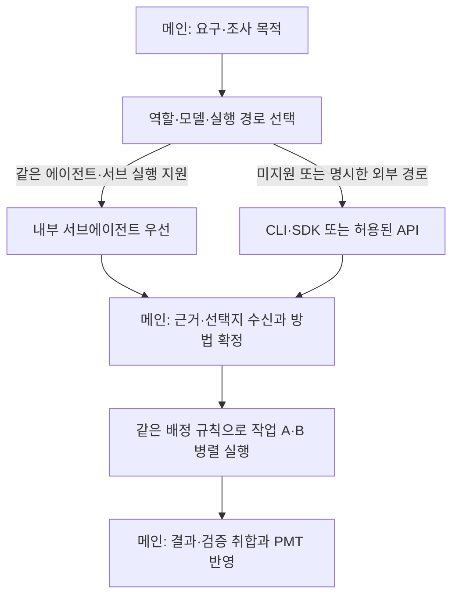

# 2단계: 모델 선정·전달·병렬 실행

1단계의 로컬 PMT 위에 모델 분배 기능을 추가한다. 메인이 조사를 위임하고 결과를 받아 방법을 정한 뒤, 확정된 작업만 병렬 실행한다.

## 처리 흐름

## 모델 역할과 배정 순서

| 역할 | 사용처 |
|---|---|
| 최상위 | 불완전한 요구사항의 큰 기준 탐색, 고난도 추론·판단 |
| 상위 | 방법 탐색·세부계획, 하위 모델 지휘, 검증 기준·결과 판정 |
| 하위 | 정해진 방법의 실행·구현·수정·검증·테스트 |

1. 사용자가 실행 방식을 명시하면 그 선택을 우선한다.
2. 기본 `auto`에서는 메인과 같은 코딩 에이전트가 대상 모델·도구·권한을 지원하면 **내부 서브에이전트**를 우선한다.
3. 내부 실행이 불가능하면 제품별 외부 CLI/SDK 연결부를 사용한다. 직접 모델 API는 허용된 경우에 사용한다.
4. 내부 동시 실행 한도에 걸리면 Queue에서 기다린다. 시작된 작업을 다른 경로에 중복 배정하지 않는다.

조사·구현·검증 모두 같은 순서를 적용한다. 같은 모델 제공자라는 이유만으로 내부 지원을 가정하지 않는다. 서브 실행은 메인 세션의 네이티브 도구로 호출하고 부모-자식 실행 ID를 연결한다. 요청 모델과 실제 사용 모델이 다르면 결과에 표시한다.

제품별 모델 지정과 제약은 공식 규약을 확인한다. [Codex 서브에이전트](https://learn.chatgpt.com/docs/agent-configuration/subagents), [Claude Code 서브에이전트](https://code.claude.com/docs/en/sub-agents), [OpenCode 에이전트](https://opencode.ai/docs/agents/).

## 요구사항·계획 규칙

- 원래 요구사항을 보존하고, 트리의 각 요약은 한 줄 50자 이내로 작성한다.
- 단일 행동까지 요구사항을 분해한 후 구현 방법을 정한다.
- 방법은 실제 가능한 대안 3개 이상을 각 30자 이내로 제시한다. 직접 작성·AI 자유 선택도 제공한다. 대안이 부족하면 허수 대신 부족함을 표시한다.
- 원리·증거가 부족한 방법은 확정 계획으로 승격하지 않고 탐색·실험 작업으로 분리한다.
- 하위 모델이 정해진 방법으로 실행할 수 있을 만큼 구체화하되, 파일별 수정 지시 목록까지 미리 작성하지 않는다.
- 대원칙 변경 시 기존 가지를 활성 계획에서 제외하고 파기 이유·증거를 보존한다. 종속 대기 작업과 진행 작업도 취소·중단·재계획한다.
- AI 자율 범위는 하위 트리에 상속한다. 그 범위의 수정은 재질문 없이 처리한다.
- 사용자에게는 선택·기준 변경이 필요한 지점만 제시한다. 설명을 요청하면 대전제·문제점·방법·필요한 원리 순으로 설명한다.
- 요구 트리의 목표와 실행 범위를 기준으로 Project·분류·Work·Item을 생성하고 연결한다.

## 스킬과 실행 연결부

| 구성 | 담당 |
|---|---|
| 조사·실행·검증 스킬 | 역할, 지시사항, 자율 범위, 완료 기준, 결과 형식 |
| 제품별 전달 스킬 | 제품에 전달할 입력·문맥과 결과 해석 규칙 |
| 실행 연결부 | 실제 서브 호출·프로세스·SDK·HTTP 연결, 실행 ID·취소·결과 수신 |

실행 연결부는 `start / status / result / cancel`로 통일한다. 스킬만으로 실제 호출 기능이 생긴다고 가정하지 않는다.

| 외부 연결이 필요할 때 | 초기 방식 |
|---|---|
| Codex | `codex exec --json`과 구조화된 결과 수집. [공식 문서](https://learn.chatgpt.com/docs/non-interactive-mode) |
| Claude Code | `claude -p --output-format json` 또는 SDK. [공식 문서](https://code.claude.com/docs/en/headless) |
| OpenCode | 선택 버전의 로컬 HTTP 서버·SDK. [공식 문서](https://opencode.ai/docs/server/) |
| 직접 모델 API | 제공자 HTTPS API로 조사·선택지 생성부터 지원. 코드 작업은 도구 실행 기능을 연결한 뒤 활성화 |

에이전트·제공자·모델·인증 방식은 별도로 설정한다. ChatGPT 로그인 기반 Codex 사용과 OpenAI API 직접 호출은 구분한다. freeLLMAPI 등 추가 연결은 실제 제공자·규격·도구 지원을 확인한다. 직접 API를 끄는 설정이 에이전트 자체의 모델 통신까지 끄는 것은 아니다.

## 요청·실행·반환

| 구분 | 최소 내용 |
|---|---|
| 요청 | request_id, parent_run_id, role, agent, model, connection_mode, skill_version, 지시, context_refs, workspace, 허용 범위, 완료 기준 |
| 실행 | job_id, run_id, native_subagent_id, 실제 경로·모델, 상태, 시작·종료 시각 |
| 결과 | 요약, 선택지·근거 또는 변경·검증 결과, evidence_refs, 오류 |

`connection_mode`는 `auto / subagent / cli / api`로 구분하며 `cli` 경로는 SDK 연결도 포함한다. 자격 증명은 로컬에 별도 보관한다.

요청 Queue와 실행 상태는 로컬 PMT에 저장한다. 하위 모델에는 필요한 문맥·범위·완료 기준을 명시적으로 전달한다. 작업 공간을 분리하고 같은 파일·공유 배포 대상의 충돌은 직렬 처리한다.

결과는 완료 순서대로 수집하고 PMT에 보존한 뒤 메인에 반환한다. 네이티브 반환, 대기 호출·로컬 콜백 또는 run_id 결과 조회를 사용한다. 메인이 닫혀도 다음 세션에서 결과를 조회할 수 있어야 한다. 닫힌 세션을 자동으로 깨우는 기능은 필수가 아니다.

실패·시간 초과·형식 불일치는 failed/blocked로 보고하고 메인이 재시도를 판단한다. 유효한 기존 검증은 적용 조건을 확인해 재사용하고, 병렬 변경을 합친 상태의 검증은 별도로 판단한다.

## 긴급 작업

실서비스 문제는 최소 증거를 남기며 허용 범위에서 복구를 우선한다. 이후 원인 재현 → 원리·근거 확인 → 재발 방지 계획 → 수정·회귀 테스트 → 지식 갱신을 같은 이력으로 연결한다. 서비스 회복과 근본 원인 해결은 별도 완료 기준으로 관리한다.

## 완료 기준

- 같은 에이전트의 지원 모델은 서브 경로로 실행된다.
- 미지원 조합과 명시한 외부·API 경로를 구분한다.
- 조사 결과가 선택지·근거 형식으로 메인에 반환된다.
- 확정된 작업만 병렬 실행되고, 메인이 증거를 확인해 완료 처리한다.
- 중단 후 결과를 조회할 수 있고 다른 경로로 같은 작업을 중복 실행하지 않는다.
