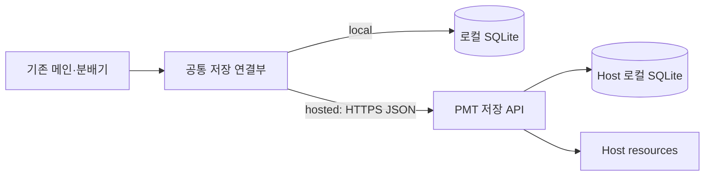

# 3단계: PMT 저장 서버와 플러그인 연결

1단계의 저장 기능을 서버 API로 감싼다. 2단계의 메인 세션·스킬·모델 분배·코드 실행은 각 작업 환경에 유지한다.

## 처리 흐름

동일한 `read_context / save_change / claim_task / finish_task`를 유지하고 저장 연결부만 `LocalStore` 또는 `HttpStore`로 선택한다.

## 기술 선택

| 기술 | 선정 이유 |
|---|---|
| Python | 1단계 저장 모듈·검증 규칙을 서버에서도 재사용 |
| FastAPI + Pydantic | API 노출, 요청·응답 형식 검사, OpenAPI 계약 관리. [공식 기능](https://fastapi.tiangolo.com/features/) |
| Uvicorn | FastAPI 실행용 ASGI 서버. 초기 단일 서비스 운영. [공식 실행 안내](https://fastapi.tiangolo.com/deployment/manually/) |
| SQLite | 기존 데이터 구조·트랜잭션 재사용. 서버 로컬 디스크에만 배치. [공식 네트워크 지침](https://www.sqlite.org/useovernet.html) |
| Caddy 또는 기존 프록시 | 호스팅 시 HTTPS 제공. Caddy는 인증서 운영 간소화를 위한 선택. [공식 안내](https://caddyserver.com/docs/automatic-https) |

상시 켜진 Linux 서버 한 대에서 시작한다. 반복 배포가 필요할 때 Docker Compose 구성을 붙인다. 이미지·설정·DB·리소스 경로는 분리한다. 로컬 모드는 계속 사용할 수 있어야 한다.

SQLite 쓰기는 짧은 트랜잭션과 제한된 재시도로 처리한다. 쓰기 경합이나 다중 Host 요구가 실제로 커지면 DB 전환을 검토한다. 여러 컴퓨터에서 SQLite 파일을 직접 공유하지 않는다.

## 통신 규약 초안

기본은 HTTPS + JSON + `/api/v1`의 요청/응답이다. PMT 저장 서버 통신은 모델 제공자 API 통신과 별개다. 이 단계에 서버발 Callback 푸시나 원격 모델 분배는 필요하지 않다.

| 기능 | API 초안 | 최소 계약 |
|---|---|---|
| 문맥 조회 | `GET /api/v1/context` | scope_id, 최신 상태·revision 반환 |
| 변경 저장 | `POST /api/v1/changes` | request_id, expected_revision, 내용·이유 |
| 작업 점유 | `POST /api/v1/tasks/{id}/claim` | 소유자·버전 확인 후 점유 토큰 반환 |
| 완료 반영 | `POST /api/v1/tasks/{id}/finish` | 점유 토큰, 계획 버전, 결과·검증·증거 참조 |
| 리소스 저장 | `POST /api/v1/resources` | 범위·파일·해시, 저장 완료 후 artifact ID 반환 |

- 장치별 인증과 API·DB 스키마 버전 호환을 확인한다.
- 같은 request_id의 같은 요청은 한 번만 반영한다. 같은 ID의 다른 내용은 거부한다.
- revision 또는 점유자가 다르면 충돌로 반환하고 최신 내용을 다시 읽는다.
- 가능 여부 확인과 점유는 서버에서 원자적으로 처리한다. 성공 응답을 받은 뒤에만 실행한다.
- 결과·상태·이력은 같은 DB 트랜잭션으로 반영한다. 파일은 업로드·해시 확인이 끝난 뒤 참조한다.
- 오래된 소유자의 완료는 거부한다. 자동 만료·재배정을 도입하면 갱신·로컬 중단·작업 격리를 함께 구현한다. 초기에는 명시적인 점유 해제·복구로 시작할 수 있다.

## 플러그인 setup

1. local/hosted와 URL·포트·인증 선택.
2. API 호환과 연결 확인.
3. 기존 환경 ID·저장소 ID·로컬 경로 매핑 등록.
4. 읽기·쓰기와 훅 활성화 확인.
5. 기존 모델 정책·실행 연결부를 유지한 채 선택한 저장소 사용.

1단계에서 검증한 플러그인에 hosted 연결을 추가한다. 코드와 데이터는 분리하고 업데이트로 DB를 교체하지 않는다. 제품별 설치·훅 규약에 맞춘 연결부를 유지한다. [Codex 플러그인](https://developers.openai.com/plugins/build/plugins), [Claude Code 플러그인](https://code.claude.com/docs/en/plugins), [OpenCode stable 플러그인](https://opencode.ai/docs/plugins/).

## 이관·단절·복원

- 이관: 로컬 쓰기 중지 → DB·resources 백업 → Host 가져오기 → ID·행 수·해시 검사 → hosted 전환.
- 최초 Host 생성 또는 비어 있는 범위 가져오기부터 지원한다. 여러 로컬 DB의 자동 병합은 후속 기능이다.
- 서버 단절 시 신규 공유 작업의 점유·변경을 중단한다. 이미 나온 결과는 로컬 보류함에 남긴다.
- 재연결 후 현재 revision·소유권을 확인해 반영한다. 로컬 캐시를 별도 원본으로 전환하지 않는다.
- DB 이관·업데이트 전 복구 가능한 백업을 만들고, 코드·DB·리소스가 호환되는 세트로 복원한다. 실행 중 DB 백업은 일관된 절차를 사용한다. [SQLite 백업 API](https://www.sqlite.org/backup.html).

## 완료 기준

- 회사·집에서 같은 프로젝트 상태를 조회한다.
- 한 환경의 변경이 다른 환경의 재조회에 반영된다.
- 동시 점유·동시 수정·요청 재시도에서 중복 반영이 발생하지 않는다.
- 1·2단계의 메인·스킬·분배 흐름을 변경하지 않고 저장소를 전환한다.
- 서버 단절·재연결과 API 호환 오류를 구분해 처리한다.
- 백업 복원 후 ID·관계·리소스 해시가 일치한다.
