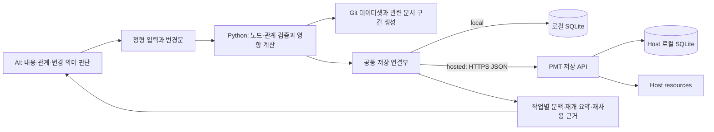

# 3단계: 문서·문맥 효율화와 PMT 저장 서버

2026-10-02 사용자 합의 반영. **3단계 구현 계획이며 아래 추가 기능은 구현 완료를 뜻하지 않는다.**

Python 기반 정형 입력·트리/연관 graph·부분 문서 생성으로 문서화와 AI 작업의 반복 비용을 줄이고, 같은 기능을 PMT 저장 서버에 연결한다. 2단계의 메인 세션·스킬·모델 분배·코드 실행은 각 작업 환경에 유지한다. 직접 모델 API 제외·서브에이전트/Claude·Codex CLI 사용 원칙을 유지하며, PMT 저장용 HTTPS API는 별도 통신이다.

입출력·원본·영향 분석·토큰 절약·측정의 상세 계약은 [문서·문맥 효율화](phase3/01-document-context-efficiency.md)를 따른다.

## 처리 흐름

동일한 `read_context / save_change / claim_task / finish_task`를 유지하고 저장 연결부만 `LocalStore` 또는 `HttpStore`로 선택한다.

## 문서·문맥 효율화 범위

2단계의 JSON graph 검증·문서 생성·파일 연결 중심 영향 분석을 확장한다. 추가 기능은 **로컬 모드에서 먼저 완성**하고 Host 연결에서도 동일한 의미로 사용한다.

| 기능 | 3단계에서 추가할 동작 |
|---|---|
| 정형 입력 | AI가 노드 종류·요약·대전제/방법·의미 I/O·기준·연결 대상의 변경분만 제출. Python이 ID·상속값·버전·참조를 처리 |
| 하나의 관계 데이터셋 | 부모/분해 관계로 두 트리를 표시하고, 구현·의존·근거 관계로 연관 graph를 조회. 같은 내용을 별도 원본으로 복제하지 않음 |
| 영향·부분 생성 | 관계 방향과 변경 종류로 문서·Step·검증 후보를 계산하고 관련 문서 구간만 재생성. 관계가 누락된 범위는 미확인으로 반환 |
| 작업별 문맥·재개 | 역할/Step에 필요한 목표·범위·계약·결정·근거만 묶어 전달하고, 재개 시 기준 commit·상태·미해결·다음 행동을 우선 조회 |
| 조사·검증 재사용 | 질문/정의·대상·환경·버전·적용/무효화 조건으로 재사용 판정. 동일 조사가 진행 중이면 원 작업 결과를 기다림 |
| Python 실행 제어 | Queue·관찰·허용된 재시도·60초 내 진행 표시를 처리하고, 오류·판단 요청·완료 등 필요한 변화만 메인 AI에 전달 |
| 출력·배정 절약 | 성공은 요약/증거 ID, 실패는 관련 오류 구간만 반환. 문맥을 공유하는 소작업 묶음과 버전에 묶인 짧은 참조 ID 지원 |

AI는 의미·대전제·관계의 타당성을 판단한다. Python은 저장·검증·조회·생성·정해진 상태 전이를 담당한다. 규칙 통과나 모델의 성공 서술만으로 실제 검증 성공·업무 완료를 확정하지 않는다.

## 원본과 변경 경계

- 정형화한 프로젝트 내용의 원본은 Git의 구조화 데이터셋이다. 트리·연관 graph·생성 Markdown은 같은 노드/관계에서 나온다. 기존 수기 문서는 보존하고 편집 영역을 구별한다.
- SQLite의 역참조·문서 구간 의존성·문맥 캐시는 원본 버전/hash로 재구축 가능한 조회 인덱스다. 상태·Queue·점유·실행 이력은 기존처럼 SQLite가 원본이다.
- 관련 작업/공유 범위를 점유한 뒤 Git 최신화·입력 기준 검증 → 변경 적용·영향 확인 → 생성·기록 순으로 처리한다. Git/파일과 DB·Host 변경은 journal로 연결하며 단일 원자 작업이라고 가정하지 않는다.
- Step 지시 원문은 내부 리소스 한 곳에 보관하고 승인된 runner에 필요한 범위만 전달한다. 문맥 최적화를 이유로 관리툴 화면이나 Git 공통문서에 지시 원문을 복제하지 않는다.

## 기술 선택

| 기술 | 선정 이유 |
|---|---|
| Python | 1단계 저장 모듈·검증 규칙을 서버에서도 재사용 |
| FastAPI + Pydantic | API 노출, 요청·응답 형식 검사, OpenAPI 계약 관리. [공식 기능](https://fastapi.tiangolo.com/features/) |
| Uvicorn | FastAPI 실행용 ASGI 서버. 초기 단일 서비스 운영. [공식 실행 안내](https://fastapi.tiangolo.com/deployment/manually/) |
| SQLite | 기존 데이터 구조·트랜잭션 재사용. 서버 로컬 디스크에만 배치. [공식 네트워크 지침](https://www.sqlite.org/useovernet.html) |
| Caddy 또는 기존 프록시 | 호스팅 시 HTTPS 제공. Caddy는 인증서 운영 간소화를 위한 선택. [공식 안내](https://caddyserver.com/docs/automatic-https) |

상시 켜진 Linux 서버 한 대에서 시작한다. 반복 배포가 필요할 때 Docker Compose 구성을 붙인다. 이미지·설정·DB·리소스 경로는 분리한다. 로컬 모드는 계속 사용할 수 있어야 한다.

SQLite 쓰기는 짧은 트랜잭션과 제한된 재시도로 처리한다. 쓰기 경합이나 다중 Host 요구가 실제로 커지면 DB 전환을 검토한다. 여러 컴퓨터에서 SQLite 파일을 직접 공유하지 않는다.

## 통신 규약 초안

기본은 HTTPS + JSON + `/api/v1`의 요청/응답이다. PMT 저장 서버 통신은 모델 제공자 API 통신과 별개다. 이 단계에 서버발 Callback 푸시나 원격 모델 분배는 필요하지 않다.

| 기능 | API 초안 | 최소 계약 |
|---|---|---|
| 문맥 조회 | `GET /api/v1/context` | scope_id, 최신 상태·revision 반환 |
| 변경 저장 | `POST /api/v1/changes` | request_id, expected_revision, 내용·이유 |
| 작업 점유 | `POST /api/v1/tasks/{id}/claim` | 소유자·버전 확인 후 점유 토큰 반환 |
| 완료 반영 | `POST /api/v1/tasks/{id}/finish` | 점유 토큰, 계획 버전, 결과·검증·증거 참조 |
| 리소스 저장 | `POST /api/v1/resources` | 범위·파일·해시, 저장 완료 후 artifact ID 반환 |
| 작업 문맥·재개 | `GET /api/v1/context` 확장 | 역할·Step·기준 버전·예산·cursor → 필요한 문맥·짧은 ID 매핑·생략/추가 조회 정보 |
| 영향 조회 | `POST /api/v1/graph/impact` | 원본 식별·변경분·관계 범위 → 영향 노드/문서/검증 후보·이유·미확인 범위 |
| 재사용·공유 조사 | `POST /api/v1/reuse/resolve` | 조사/검증 정의·조건 지문 → 유효 근거, 진행 중 작업 참조 또는 새 점유 결과 |

- 장치별 인증과 API·DB 스키마 버전 호환을 확인한다.
- 같은 request_id의 같은 요청은 한 번만 반영한다. 같은 ID의 다른 내용은 거부한다.
- revision 또는 점유자가 다르면 충돌로 반환하고 최신 내용을 다시 읽는다.
- 가능 여부 확인과 점유는 서버에서 원자적으로 처리한다. 성공 응답을 받은 뒤에만 실행한다.
- 결과·상태·이력은 같은 DB 트랜잭션으로 반영한다. 파일은 업로드·해시 확인이 끝난 뒤 참조한다.
- 오래된 소유자의 완료는 거부한다. 자동 만료·재배정을 도입하면 갱신·로컬 중단·작업 격리를 함께 구현한다. 초기에는 명시적인 점유 해제·복구로 시작할 수 있다.
- 문맥·graph 인덱스는 repository/project·Git 기준·graph/템플릿 버전·hash에 연결한다. 필요한 경우 검토한 dirty 지문도 포함한다. 다른 환경/브랜치의 캐시와 짧은 ID를 그대로 재사용하지 않는다.
- Git 파일 변경·문서 생성은 해당 checkout을 점유한 클라이언트에서 수행한다. Host는 확인된 원본 참조와 재구축 가능한 인덱스를 공유하며, AI 실행이나 임의 저장소 편집을 대신하지 않는다.

## 플러그인 setup

1. local/hosted와 URL·포트·인증 선택.
2. API 호환과 연결 확인.
3. 기존 환경 ID·저장소 ID·로컬 경로 매핑 등록.
4. 읽기·쓰기와 훅 활성화 확인.
5. 기존 모델 정책·실행 연결부를 유지한 채 선택한 저장소 사용.
6. 역할별 문맥 예산·요약 정책·소작업 묶음·조회/알림 방식을 선택적으로 조정. 기본값은 필요한 기준·근거를 보존하는 절약형.

1단계에서 검증한 플러그인에 hosted 연결을 추가한다. 코드와 데이터는 분리하고 업데이트로 DB를 교체하지 않는다. 제품별 설치·훅 규약에 맞춘 연결부를 유지한다. [Codex 플러그인](https://developers.openai.com/plugins/build/plugins), [Claude Code 플러그인](https://code.claude.com/docs/en/plugins), [OpenCode stable 플러그인](https://opencode.ai/docs/plugins/).

## 이관·단절·복원

- 이관: 로컬 쓰기 중지 → DB·resources 백업 → Host 가져오기 → ID·행 수·해시 검사 → hosted 전환.
- 최초 Host 생성 또는 비어 있는 범위 가져오기부터 지원한다. 여러 로컬 DB의 자동 병합은 후속 기능이다.
- 서버 단절 시 신규 공유 작업의 점유·변경을 중단한다. 이미 나온 결과는 로컬 보류함에 남긴다.
- 재연결 후 현재 revision·소유권을 확인해 반영한다. 로컬 캐시를 별도 원본으로 전환하지 않는다.
- DB 이관·업데이트 전 복구 가능한 백업을 만들고, 코드·DB·리소스가 호환되는 세트로 복원한다. 실행 중 DB 백업은 일관된 절차를 사용한다. [SQLite 백업 API](https://www.sqlite.org/backup.html).
- 파생 인덱스·문맥 캐시가 없거나 기준이 다르면 재구축한다. 재개 요약만으로 원 결정·증거·현재 소유권을 대체하지 않는다.

## 구현 순서

1. 정형 변경 입력·고정 ID·상속·두 트리/관계 graph의 공통 계약 확정.
2. 관계 영향 분석·문서 구간 의존성·부분 생성과 Git 충돌/복구 처리.
3. 작업별 문맥·재개 요약·관련 내용 추가 조회·짧은 ID 매핑.
4. 조사/검증 중복 방지·출력 축약·소작업 묶음·Python 관찰/제어.
5. 같은 작업의 최적화 전후 토큰·호출 수·재시도·시간·품질 비교.
6. 위 계약을 저장 API·플러그인 setup에 연결하고 다중 환경·단절/재개 검증.

## 완료 기준

- 회사·집에서 같은 프로젝트 상태를 조회한다.
- 한 환경의 변경이 다른 환경의 재조회에 반영된다.
- 동시 점유·동시 수정·요청 재시도에서 중복 반영이 발생하지 않는다.
- 1·2단계의 메인·스킬·분배 흐름을 변경하지 않고 저장소를 전환한다.
- 서버 단절·재연결과 API 호환 오류를 구분해 처리한다.
- 백업 복원 후 ID·관계·리소스 해시가 일치한다.
- AI가 전체 문서/graph를 다시 제출하지 않고 노드·관계 변경분으로 작업할 수 있다.
- 부분 생성 결과가 같은 입력의 전체 생성 결과와 일치하고 수기 영역·무관한 문서·고정 ID가 보존된다.
- 역할별 문맥과 재개 요약에 필수 기준·금지 범위·미해결 문제가 빠지지 않으며, 부족한 내용만 추가 조회된다.
- 같은 조건의 조사·검증 중복 실행을 줄이고 적용 조건 변화·이후 실패·근거 손상은 재사용을 막는다.
- Python이 진행을 갱신하면서 불필요한 모델 호출을 줄이고, 기존 점유·중단·재시도·완료 규칙을 유지한다.
- [효율화 수용 시험](phase3/01-document-context-efficiency.md)을 통과하고 실측 절약 효과와 한계를 기록한다. 측정 없이 절감률을 주장하지 않는다.
