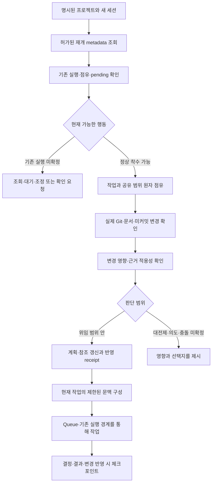

# 4단계 — AI 세션 연속성과 변경 기반 작업 재개

- 작성일: 2026-10-06, Asia/Seoul.
- 상태: **요구·설계·작업 계획**. 이 문서 작성은 4단계 코드 구현이나 시험 통과를 뜻하지 않는다.
- 확인한 코드 기준: `ac7aded`, Core 0.3.0, SQLite schema 4, graph schema 1.
- 목적: 새로운 AI 세션이 프로젝트의 현재 방향·구현·변경·근거·기존 실행을 확인하고, 허용된 범위에서 다음 작업을 스스로 결정해 이어간다.
- 상세 작업 진입점: [4단계 작업 안내](phase4/README.md).
- 병렬 구현 배정: [전체 상세계획·구현 순서](phase4/implementation-plan.md), [공유 입력/출력·연결 규격](phase4/implementation-interfaces.md). `gpt-6-luna` 세 작업자의 기능별 계획과 시험·로그·인수 조건을 연결했다.

## 1. 달성할 동작

새 세션은 다음 질문에 출처와 함께 답할 수 있어야 한다.

1. 현재 해결할 문제와 목표, 대전제, 제외 범위는 무엇인가?
2. 어떤 기능이 실제로 구현·검증됐고 무엇이 계획·미완성·미확인인가?
3. 마지막 확인 이후 코드·문서·사용자 결정이 어떻게 바뀌었는가?
4. 그 변경이 현재 작업·설계·Step·검증에 어떤 영향을 주는가?
5. 현재도 적용 가능한 원리·시험 결과와 다시 확인할 사항은 무엇인가?
6. 이전 실행·점유·미반영 결과가 남아 있는가?
7. 어떤 근거와 권한으로 다음 행동을 선택할 수 있는가?

목표는 구현 기준과 변화의 맥락을 확인한 뒤 이어가는 것이다. 모든 작업자가 같은 코드를 생성해야 한다는 조건은 두지 않는다. 기능·성능·금지 범위·검증 조건을 충족하며, 변경 이유와 적용 근거를 추적할 수 있어야 한다.

## 2. 유지할 기존 기준

- 계층은 Project → 분류 → Work → Item(재귀) → Step → 실행 시도다. 재개 기능을 업무 트리의 새 depth로 추가하지 않는다.
- 요구 트리와 구현 트리의 의미·종료 조건, 대전제와 위임 범위는 [2단계 요구](02-model-routing.md)를 유지한다.
- Git 문서·graph는 프로젝트 기준, 선택한 local/Host SQLite는 상태·점유·실행의 기준, resources는 증거·내부 지시의 기준이다.
- Step 지시 원문은 프로젝트 관리툴의 일반 문맥과 외부 동기화에서 제외한다. 실행에 필요한 현재 권한 아래에서만 읽는다.
- 작업 내용의 읽기·쓰기는 실제 점유 성공 후 수행한다. 작업 목록·현재 상태 등의 허가된 metadata 조회는 준비 단계에서 가능하다.
- 시간·idle·세션 종료·Stop만으로 완료, 정지 확인, 점유 해제 또는 새 실행을 판정하지 않는다.
- 같은 조건·정의·대상·근거가 현재도 유효하면 기존 검증을 재사용한다. 관련 조건 변화·후속 실패·증거 손상은 별도로 판정한다.
- 현재 사용자 범위대로 직접 모델 API와 실서비스 Claude 호출, 실제 사용자 데이터 전환·외부/Linux Host 배포는 추가하지 않는다. local/Host 기능은 격리된 실제 로컬 환경에서 검증한다.

## 3. 현재 구현과 추가 범위

아래는 코드 조사로 확인한 연결 기반이다. 이전 시험의 통과 수를 신규 4단계 성공으로 합산하지 않는다.

| 현재 기능 | 재사용할 내용 | 4단계 보완 |
|---|---|---|
| `read_context`와 SessionStart 문맥 조회 | 명시한 Project/Item의 짧은 상태·결정 조회 | 현재 방향·실현 상태·변경 필요 여부·다음 행동을 묶은 재개 개요 |
| `resume_task_context` | 특정 Step/run의 현재 권한·SourcePin·증거 재검증, 새 문맥 생성 | Project/Work 수준의 재개 판단과 단계별 문맥 읽기 |
| `read_project_baseline`, `sync_project_baseline` | 로컬 Git 기준 비교·점유·명시적 반영·중단 처리 | 관찰/분석/반영 기준의 구별, 의미 있는 변경 수집, hosted 저장 연결 |
| SourcePin·graph 조회·F3 영향 | 고정 ID·원본 지문·관계·known/unknown | 코드 경로와 기능/모듈/요구/시험의 연결, 외부 변경의 영향 후보 |
| F6·verification | 조건별 재사용과 실패·근거 손상 판정 | 원리·검증의 현재 적용성 표와 선택적 재확인 |
| Queue·control·batch·pending | 원 실행·handle·결과·미확정 상태·같은 요청 조정 | 새 세션의 중복 실행 방지와 다음 행동 선택에 통합 |
| Host·client mapping | 저장 전용 인증 포트, 클라이언트 Git/파일 실행 | 기준·변경·정렬 결과·체크포인트의 버전형 저장 metadata |

현재 `process_session_start`의 native 문맥 출력은 Codex와 Claude에 한정돼 있다. OpenCode는 기존 adapter의 이벤트와 반환 면을 별도로 확인하고 연결한다. 서로 같은 Hook 출력 규격이라고 가정하지 않는다.

기존 F3는 구조화 graph의 변경·preview를 검증하는 기능이다. 임의의 Git diff가 자동으로 요구·모듈의 의미를 설명하는 기능으로 간주하지 않는다. 4단계에서 연결 index와 검토된 변경 해석을 보완한다.

## 4. 정보 구성

| 정보 | 담을 내용 | 기준과 저장 |
|---|---|---|
| 현재 방향 | 목표·대전제·현재 결정·제외 범위·AI 자율 범위·성공 기준 | Git 문서/graph의 현재 참조 |
| 현재 구현 | 실제 동작·인터페이스·제약·미완성·관련 코드·확인 수준 | 검토한 코드/commit과 검증을 연결한 파생 index |
| 변경과 영향 | 이전/현재 지문, 변경 사실, 이유 또는 미확인 의도, 영향 경로 | SQLite의 변경 metadata와 원 diff/증거 참조 |
| 현재 근거 | 확정 원리·시험 결과·적용 조건·후속 실패·무효 이유 | 기존 검증·resources 참조, 적용성 판단 metadata |
| 진행 상태 | 완료/진행/미확인·점유·실행·pending·다음 행동 | 현재 SQLite 업무 상태 |
| 재개 요약 | 위 정보의 필수 부분·누락·출처·상세 읽기 참조 | Python이 생성하는 source-bound 파생 문맥 |

같은 본문을 Git·SQLite·요약에서 각각 수정하는 방식은 사용하지 않는다. 해석은 사실·제안·적용된 결정·검증 결과와 구별한다. Code 존재만으로 구현 검증 완료를 표시하지 않는다.

## 5. 새 세션의 처리 흐름

요약 생성과 실제 착수 사이에도 권한·원본·업무 revision을 다시 확인한다. 프로젝트가 지정되지 않으면 후보를 허가된 metadata로 제시하고 선택한다. 경로나 최근 대화만 보고 다른 프로젝트를 자동 선택하지 않는다.

## 6. 갱신 시점

| 경계 | 기록·갱신 |
|---|---|
| 작업 착수 확정 | 목표와 원본/요구/계획/지시 기준, 실제 범위·점유 참조 |
| 사용자 선택 또는 위임 결정 | 결정의 주체·이유·범위·근거·기존 결정과의 관계 |
| 의미 있는 개발 변경 | 실제 변경, 영향 후보, 확인한 기준과 미확인 사항 |
| 검증 결과 확정 | 결과·정의·대상/환경/도구 조건·근거·재사용 적용성 |
| 변경 반영 완료 | 수정된 문서/graph/계획·검증 기준과 적용 receipt |
| 명시적 중단·결과 검토 | 남은 작업·미확정 실행·실제 결과·다음 조치 |
| SessionStart/Stop | 관찰 사실만 저장; 실제 착수/종료/완료와 구별 |

매 도구 호출·heartbeat·전체 대화를 요약해 업무 이력으로 쌓지 않는다. 중단 Hook이 누락돼도 마지막 확정 checkpoint와 현재 실제 상태에서 재개할 수 있어야 한다.

## 7. 구현 순서와 배정

| 기능 | 목적 | 직접 선행 |
|---|---|---|
| R0 공통 계약·호환 | 정보/권한/버전/저장·오류 의미 확정 | 현재 1~3단계 조사 |
| R1 현재 사실·체크포인트 | 현재 구현·방향·실행 기준 연결 | R0 |
| R2 변경 수집·연결 index | 기준 이후 코드·문서·결정 변경 수집 | R0; 실제 checkpoint 연결은 R1 |
| R3 영향·근거·방향 반영 | 검토된 변경의 영향과 현재 적용성 판정 | R1, R2 |
| R4 재개 문맥·행동 제안 | 예산 안의 개요/작업 문맥과 다음 행동 | R1, R3 |
| R5 Hook·스킬·제품 연결 | 세션과 의미 있는 경계에 공통 서비스 연결 | R4 |
| R6 Host·통합·측정 | 두 환경·실제 재개·업데이트·효율 확인 | 준비된 R0 포트로 Host 선행 준비; 최종 수용은 R5 |

메인은 R0·공통 schema/인터페이스·통합·최종 판정을 담당한다. `gpt-6-luna` 작업자는 현재 실행 한도 안에서 최대 3개로 배정한다. R0 확정 뒤 A는 R1/문맥 준비, B는 R2, C는 Hook/Host/시험 대역 준비를 병렬 진행한다. R3 확정 뒤 R4/R5 소비를 연결한다. 상세 범위와 관문은 [상세계획](phase4/implementation-plan.md)을 따른다.

## 8. 완료 기준

- 대화 원문 없이 새 세션이 현재 방향·구현·유효 근거·미확인 사항을 출처와 함께 파악한다.
- 같은 기준을 반복 분석하거나 동일 작업/검증을 다시 실행하지 않는다.
- 외부 변경은 실제 diff와 관련 연결을 검토하고 위임 범위 안의 수정으로 이어진다.
- 이전 실행·미커밋 작업·pending·수기 문서와 무관한 가지를 보존한다.
- 오래된 summary·지시·source·다른 환경의 결과로 현재 완료/실행을 확정하지 않는다.
- local과 hosted 모두 같은 업무 의미를 유지하고 Git/모델/코드 실행은 클라이언트에 남는다.
- 계획한 기능의 자체·실제 연계 시험, 진단 실패·비밀 제외·중단/재처리, 새로운 모델 세션의 의미 이해를 별도 증거로 확인한다.
- 사용 가능한 계층의 완료와 제품 미설치·외부 배포·usage 미제공을 구별한다. byte 감소를 token 절감률로 표시하지 않는다.

시험과 기록은 [검증 명세](phase4/verification.md)를 따른다. 4단계 작성 시점에는 구현/시험 기록을 추가하지 않았으며 코드 버전·SQLite/graph schema를 올리지 않는다.

## 9. 읽을 근거

- 현재 공개 연결: [3단계 실제 API](phase3/implemented-api.md), [구현 상태](phase3/implementation-status.md), [Host 실제 계약](phase3/host-api-contract.md).
- 원본·계층·검증·점유: [데이터](pmt-docs/data-contracts.md), [실행](pmt-docs/execution-contracts.md), [개발](pmt-docs/development.md), [운영](pmt-docs/operations.md).
- 공식 설계 참조: [Atlassian PRD](https://www.atlassian.com/agile/product-management/requirements/), [Google ADR](https://docs.cloud.google.com/architecture/architecture-decision-records), [Google code review](https://google.github.io/eng-practices/review/reviewer/looking-for.html), [Microsoft 성능 목표](https://learn.microsoft.com/en-us/azure/well-architected/performance-efficiency/performance-targets).

공식 자료는 요구·결정·검토·성능 측정의 원칙을 참고한 것이다. PMT의 checkpoint·정렬 receipt·재개 정책과 데이터 필드는 이 프로젝트의 설계 선택이며 대기업의 공통 내부 규격으로 주장하지 않는다.
