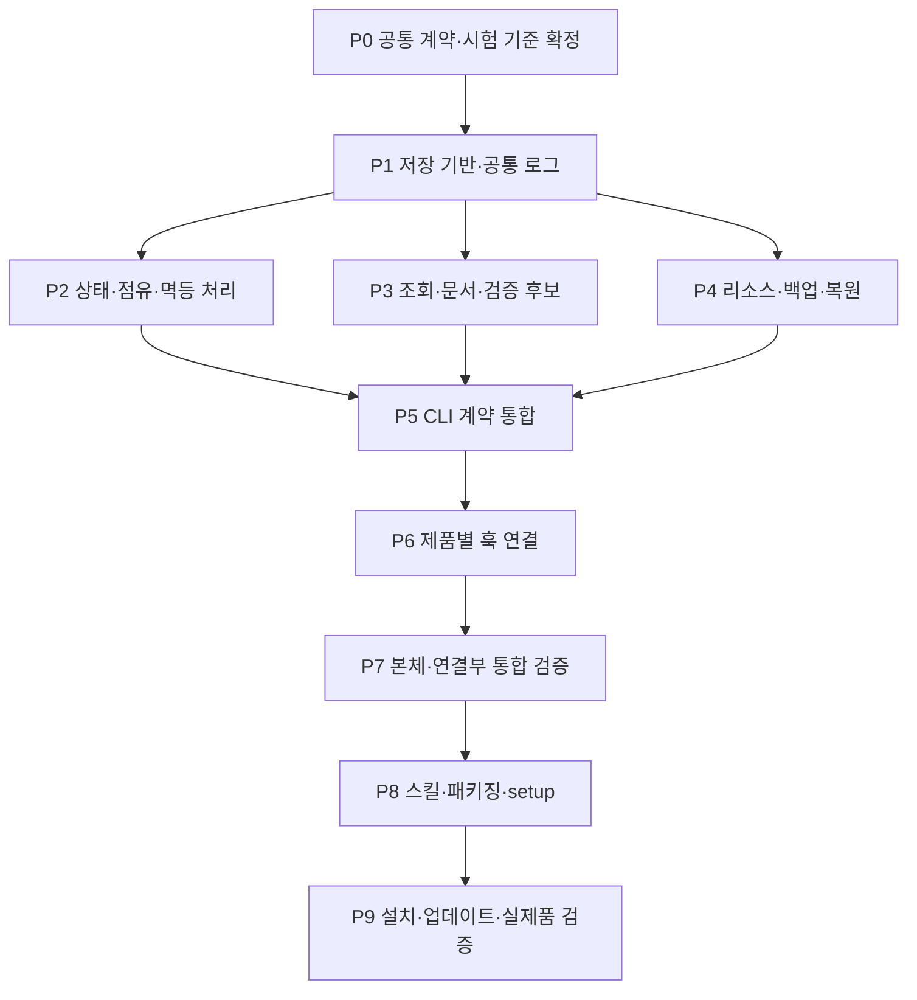

# 1단계 상세계획: 로컬 구현부터 설치 검증까지

- 기준일: 2026-10-01
- 상태: 본체·제품 연결·패키징 구현 후 실제 설치 검증 진행 중. 최신 실행 결과는 [구현·검증 현황](implementation-status.md)을 따른다. 아래 항목은 수용 기준이며 그 자체가 실행 성공을 뜻하지 않는다.
- 작성 검토: `gpt-6-luna` 3개 작업자가 저장 계약, 제품·플러그인 연결, 테스트·로그를 병렬 검토하고 메인이 통합했다.
- 목표: 새 세션이 근거를 이어받고, 같은 작업·이벤트를 중복 처리하지 않는 로컬 PMT를 실제 설치 가능한 형태로 제공한다.

## 참조 문서

| 문서 | 답하는 내용 |
|---|---|
| [AGENTS.md](../../AGENTS.md) | 전체 작업 규칙·소유권·병렬 배정·보고 |
| [contracts.md](contracts.md) | 데이터·명령 입출력·상태·동시성·오류 |
| [work-packages.md](work-packages.md) | 각 작업의 목적·이유·기술·입출력·관계·완료 기준 |
| [verification.md](verification.md) | 시험 ID·전제·입력·합격 조건·증거·검증 단계 |
| [logging.md](logging.md) | 업무 이력·진단 로그·시험 증거·실패 시 기록 |
| [adapters-packaging.md](adapters-packaging.md) | 제품별 연결·설치·업데이트·실제 동작 확인 |

## 1단계의 범위

저장·문맥 조회·점유·명시적 완료·리소스·검증 기록·로컬 CLI·제품별 훅·작업 스킬을 구현한다. 본체 검증 후 플러그인과 local setup을 만들고 설치·업데이트·제거 후 재설치·새 세션 재개까지 검증한다.

역할별 모델 분배·외부 LLM API 호출은 2단계, HTTPS 저장 서버는 3단계다. 1단계에는 원격 Queue·Callback 푸시·오프라인 양방향 동기화를 추가하지 않는다. 동일 검증의 정확한 조건 비교와 근거 조회는 1단계에 포함하고 영향 범위를 추론하는 자동 판단은 후속으로 둔다.

## 기술 결정과 이유

| 선택 | 이유·적용 범위 | 근거 |
|---|---|---|
| Python 3.13 기준 | 현재 작업 환경에서 사용할 수 있고 CLI·파일·프로세스·SQLite를 한 런타임으로 처리 | [Python sqlite3](https://docs.python.org/3.13/library/sqlite3.html) |
| 표준 `sqlite3`, JSON, hashlib, logging | 초기 런타임 의존성을 줄이고 데이터·진단 계약을 직접 관리 | [logging](https://docs.python.org/3/library/logging.html) |
| pytest 개발 의존성 | 격리 데이터·실패 주입·수용 시험을 재현하고 결과를 기계적으로 수집 | [임시 데이터](https://docs.pytest.org/en/stable/how-to/tmp_path.html), [실패 주입](https://docs.pytest.org/en/stable/how-to/monkeypatch.html) |
| 독립 subprocess | 여러 세션·재시작·실제 CLI 경합을 구현 내부 모의 호출과 구분해 확인 | [subprocess](https://docs.python.org/3/library/subprocess.html) |
| 제품별 얇은 연결부 | 제품 차이는 연결부에서 처리하고 데이터 규칙은 한 본체에 유지 | [제품 규약](adapters-packaging.md#제품별-연결-계약) |

Python·SQLite의 실제 버전과 journal 설정을 시험 기록에 남긴다. SQLite 쓰기는 직렬화되므로 짧은 트랜잭션으로 설계한다. DB 설정은 암묵적인 Python 기본값에 의존하지 않는다. [SQLite 격리](https://www.sqlite.org/isolation.html).

최초 수용 대상은 Windows + Python 3.13 + Codex·Claude Code·OpenCode의 지정 버전이다. 각 제품 버전·권한·설치 여부를 시험 전에 고정한다. 다른 OS·Python 버전은 해당 시험 통과 후 지원 표에 추가한다. 현재 PATH에서 Codex·Claude Code는 발견됐고 OpenCode는 발견되지 않았다. 이는 동작 검증 결과가 아니며 설치 E2E에서 다시 확인한다.

## 구현 순서와 병렬 배정



| 시기 | `gpt-6-luna` 병렬 배정 | 메인의 책임 |
|---|---|---|
| 계약 확정 중 | 제품 입력 fixture·시험 데이터·공식 지원 조사 준비 가능 | P0의 의미·입출력·오류·시험 ID 확정 |
| 기반 준비 후 | P2·P3·P4를 각각 한 소유자에게 배정 | 공통 스키마·로그·인터페이스 일치 확인 |
| CLI 통합 후 | P6의 Codex·Claude·OpenCode 연결부를 각각 배정 | 같은 normalized event·반환 계약 검사 |
| 본체 검증 통과 후 | P8 제품별 패키징을 독립 배정 가능 | 공통 버전·사용자 데이터·setup 계약 통합 |
| 설치 검증 | 격리 프로필·데이터·작업 공간이 독립인 제품 시험 병렬 가능 | P9의 실제 증거·지원 범위·전체 완료 판정 |

기본 동시 작업자는 3개다. 현재 에이전트 실행 한도를 넘기지 않는다. 스키마·공통 모델·CLI envelope·오류·공통 로그는 단일 소유 영역이다. 소유 영역이 겹치는 작업은 직렬로 처리한다. 시험 fixture는 미리 준비할 수 있지만 테스트 성공은 실제 구현을 대상으로 실행한 후에만 기록한다.

## 완료 단계

| 단계 | 통과 조건 |
|---|---|
| G0 계약 준비 | P0의 규약과 시험 ID에 모순 없음. 공통 변경 책임·작업 입력·출력이 정해짐 |
| G1 본체 검증 | P1~P7의 필수 DB·CLI·리소스·fixture·재개 시험 통과 |
| G2 패키지 준비 | G1 통과. 설치 파일·버전·경로·의존성·제품별 설정 검사 통과 |
| G3 1단계 완료 | P9 실제 설치·훅·새 세션·업데이트·데이터 보존 시험이 목표 제품에서 통과 |

제품 미설치·권한·신뢰 설정 부족은 해당 시험의 `blocked`다. fixture 성공으로 G3를 대신하지 않는다. 구현·시험·설치 결과와 필요한 후속 작업을 메인이 최종 보고한다.

## 작업 지시와 인계

각 지시는 아래 항목으로 구성한다. 상세 예시는 작업 묶음의 계약을 그대로 전달하면 된다.

```text
작업 ID / 목표 / 작업 이유
범위와 연관 구성 요소 / 소유 영역 / 제외 범위
선행 작업과 승인된 계약 버전
입력 / 출력 / 필요한 기술·공식 근거
필수 시험 ID / 예상 결과 / 필수 로그·증거
완료 기준 / 공통 계약 변경 시 보고할 내용
```

인계는 `작업 ID, 결과, 실제 변경 영역, 계약 버전, 수행 명령과 실제 종료 코드, 시험 ID별 상태·증거, 대상 commit·dirty 지문, 환경, 미해결·다음 조치`를 포함한다. 메인은 계약 적합성 → 관련 검증 → 통합을 순서대로 확인한다. 재사용할 시험은 [검증 규칙](verification.md#시험-결과-재사용)을 따른다.
