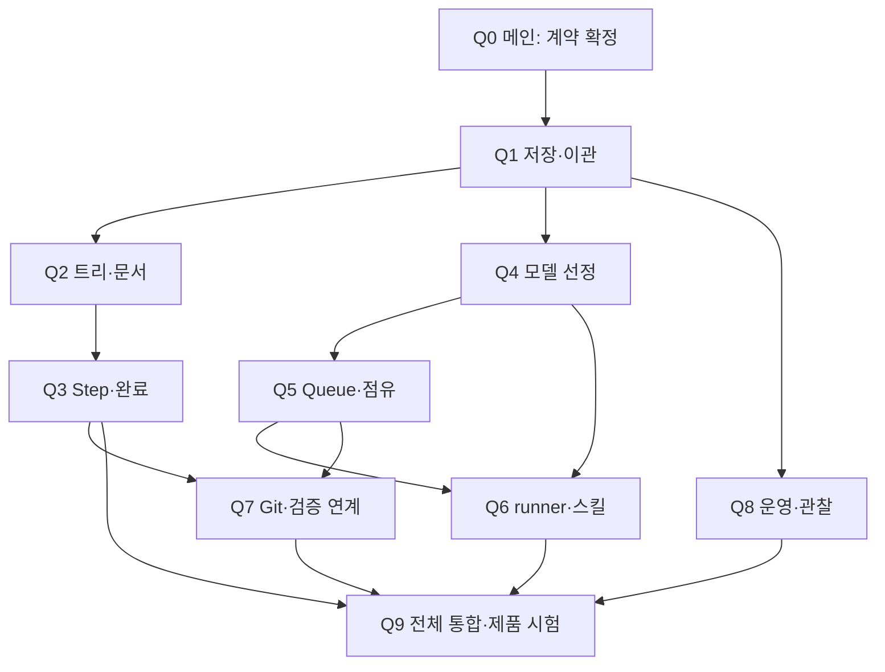

# 2단계 상세 구현 계획

2026-10-01 작성. **계획 확정용 문서이며 2단계 구현·시험 완료 기록이 아니다.** 요구 기준은 [2단계 문서](../02-model-routing.md), 구조·개발 규칙은 [공통 참조](../pmt-docs/README.md)와 [AGENTS.md](../../AGENTS.md)다.

구현 착수 후 사용자가 [직접 API 제외·로컬 검증 범위](scope-decisions.md)를 지정했다. 해당 결정이 기존 실행 경로 제안과 수용 시험보다 우선한다.

구현과 실측 결과는 [구현 상태](implementation-status.md), 실제 operation 사용은 [사용법](usage.md)을 따른다. 아래 작업 묶음·시험 계획은 계획 이력이다.

목표는 자연어 요구 → 구현 요구 → 프로젝트 문서/graph → Step → 모델 배정 → 안전한 병렬 실행 → 결과 검토를 로컬 PMT에 연결하는 것이다. 현재 Python 표준 라이브러리·SQLite·JSON CLI와 제품별 훅을 확장한다. 추가 기술은 실제 제품 연결에 필요한 범위에서만 도입한다.

## 작업 지시 문서

| 묶음 | 담당 기능 | 참조 |
|---|---|---|
| Q0 | 공통 계약·소유 경계·제품 지원 확인 기준 | [공통 계약](contracts.md) |
| Q1 | Step/Queue/점유 저장·기존 데이터 이관 | [저장 기반](storage-work.md) |
| Q2 | 두 트리·조사·선택지·명세·문서/graph | [계획 작업](planning-work.md) |
| Q3 | Step 지시·계층·완료 검토·대전제 변경 | [계획 작업](planning-work.md) |
| Q4 | 가용 자원·초기 설정·역할/모델/경로 선정 | [실행 작업](execution-work.md) |
| Q5 | Queue·범위 lock·실행 상태·취소/복구 | [실행 작업](execution-work.md) |
| Q6 | 제품 runner·전달 스킬·메인 결과 회수 | [실행 작업](execution-work.md) |
| Q7 | Git 최신화·변경 영향·근거 재사용 | [통합 작업](integration-work.md) |
| Q8 | 진행·로그·보존·정리·진단 | [통합 작업](integration-work.md) |
| Q9 | CLI/훅 통합·패키징·실제 제품 수용 시험 | [통합 작업](integration-work.md) |

각 묶음의 input/output은 값의 **의미·제약**이며 실제 운영 값이나 파일별 수정 목록이 아니다. 작업자는 읽어야 할 참조와 승인 버전을 확인하고, 실제 변경 영역을 제안한 뒤 소유권을 확정한다.

## 병렬 순서·통합 관문

| 관문 | 시작/종료 기준 | 배정 |
|---|---|---|
| G0 공통 기준 | Q0 계약·오류·소유자·시험 ID·제품 확인 항목 확정 | 메인; 제품 조사는 읽기 전용 병렬 준비 가능 |
| G1 기반 | Q1 이관·원자성·기존 데이터 보존 시험 통과 | 저장 담당 1명, 메인 검토 |
| G2 독립 기능 | Q2/Q4/Q8 자체 시험과 공통 경계 인계 | `gpt-6-luna` 3명 병렬 |
| G3 실행 준비 | Q3/Q5 자체 규칙·계약 시험, 이어 Q6/Q7 연결; 연계 수용 시험은 G4까지 추적 | 준비된 독립 묶음부터 최대 3명; 공유 변경 직렬화 |
| G4 통합 완료 | Q9와 [전체 수용 시험](verification.md) 충족, 증거/문서 갱신 | 메인 최종 판정, 제품별 확인 작업 분담 |

이 순서는 PMT의 2단계를 완성하기 위한 구현 순서다. 관리 대상 프로젝트의 prototype/expansion/production 범위와 다르다. fixture 기반 준비는 실제 제품 확인을 대신하지 않는다.

## 배정·소유 규칙

- 메인은 Q0, 공유 서비스/CLI 연결, 공통 계약 확정, 통합·최종 검증·Git을 소유한다. 구현 작업자는 사용자 지정 `gpt-6-luna`다.
- Q1이 스키마·이관·공통 저장 제약을 소유한다. Q3/Q5/Q8 등의 변경 요구는 Q1 담당 또는 메인에게 전달한다. 후속 소비자가 공유 스키마를 각각 수정하지 않는다.
- Q2 planning, Q3 Step 업무, Q4 routing, Q5 execution, Q6 runners/전달 절차, Q7 reconciliation, Q8 운영의 소유 경계를 유지한다. Q9에서 발견한 오류도 해당 소유자에게 돌려준다.
- 작업별 시험은 그 작업자가 소유하고 공통 fixture·dispatcher·의존 설정·패키징의 변경은 메인이 조정한다. 한 묶음의 개발과 독립 검증을 동시에 같은 영역에 배정하지 않는다.
- 실제 실행 한도 안에서 독립 작업 최대 3개를 배정한다. 같은 에이전트가 지정 모델·도구·권한을 지원하면 native subagent를 우선한다. 현재 요청은 계획 작성이며 이 문서 자체가 코드 구현 착수 기록은 아니다.

## 메인의 지시·하위의 반환

지시에는 묶음/Step ID, 계약·요구/계획/지시 버전, 목적·goal/non-goal, 기능 변경 범위·금지 경계·자율성, input/output, 기술·근거·선행 산출물, 시험 ID·로그/증거·완료 기준을 포함한다. 관련 문서만 참조하고 전문을 매번 복제하지 않는다.

반환에는 실제 변경 영역·산출물, 기준별 pass/fail/blocked/not_run, 실제 모델/경로·지시 버전, 시험 명령·종료 코드·대상 commit/dirty·환경 지문·증거, 계약 변경 제안·미해결·다음 조치를 포함한다. 공통 계약 변경·제품 미지원·모호한 완료 기준은 메인에게 보고한다.

2단계 완료는 전체 요구·제품 연결의 구현과 시험으로 판정한다. 인증/권한/지원 기능 부족은 blocked로 남기며 완료 관문이 열린 것으로 처리하지 않는다. Host 서버·외부 관리툴 동기화·닫힌 메인 자동 기상은 후속 범위다.
