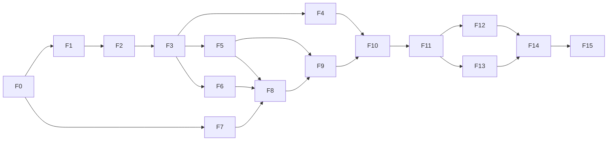

# 3단계 기능 목록·의존성·구현 순서

2026-10-02. 기능 구분·선행 관계·순서를 기준으로 아래 **기능 명세**를 작성했다. 문서는 구현할 계약과 예정 시험이며 코드 구현·실측 통과 기록이 아니다.

범위는 [3단계 전체 계획](../03-hosted-storage.md)과 [문서·문맥 효율화 방향](01-document-context-efficiency.md)을 따른다. 직접 모델 API는 제외하며, 네이티브 서브에이전트·Claude/Codex CLI 실행은 로컬에 둔다. Host는 PMT 저장·공유 기능을 담당한다.

기능별 실제 구현 배정은 [상세 구현 계획](implementation-plan.md)과 [구현 연결 규격](implementation-interfaces.md)을 기준으로 한다. `gpt-6-luna` 3개가 영역별 계획을 병렬 작성했고, 기능 명세의 48개 예정 시험과 단계별 처리·오류/복구·인계·통합 관문을 연결했다. 계획의 논리 Step ID는 실제 PMT UUID와 구별한다.

## 기능 명세 안내

| 기능 | 문서 |
|---|---|
| F0 공통 기준·저장 포트·비교 기준 | [공통 계약](contracts.md) |
| F1~F4 정형 변경·graph 조회·영향·부분 생성 | [데이터·문서 명세](spec-graph-document.md) |
| F5~F9 문맥·재사용·출력·제어·묶음 | [문맥·실행 명세](spec-context-execution.md) |
| F10 로컬 통합·효율 판정 | [로컬 통합·측정 명세](spec-local-measurement.md) |
| F11~F15 Host·연결·이관·복구·전체 통합 | [Host·통합 명세](spec-host-integration.md) |
| 전체 시험·로그 대조·관문·인계 | [시험·인계 명세](verification.md) |

기능별 명세는 목적/이유, 추가·수정·삭제 범위, goal/non-goal, input/output의 의미·타입·제약·실패, 구현 방식/기술/원리, 선행/소비자/소유, 코드동작 Test·로깅, 완료·인계·자율/메인 판단을 포함한다. 2단계 명세 형식을 재사용하며 운영 실값이나 파일별 수정 레시피를 지시하지 않는다.

## 기능 목록과 직접 의존성

2단계의 저장·graph 검증/생성·Queue/lock·runner·Git 확인·검증/리소스·진행 기능을 재사용·확장한다. 표의 선행 항목은 **3단계에서 추가로 필요한 직접 의존성**이며 공통 기존 기능은 반복 표기하지 않는다.

| ID | 기능 | 구현할 범위 | 선행 |
|---|---|---|---|
| F0 | 공통 기준·저장 경계·비교 기준 | 원본/파생 데이터·버전·기존 데이터 호환, 로컬/Host 공통 저장 경계와 최적화 전 비교 기준 확정 | 기존 2단계 |
| F1 | 정형 노드·관계 변경 | 전체 재작성 대신 생성/갱신/연결/해제/폐기 변경분 처리, ID·상속·기본값·버전 관리 | F0 |
| F2 | 트리·연관 graph 조회 기반 | 같은 데이터셋의 두 트리/연관 graph 조회, 역참조 인덱스·원본 매핑·재구축 | F1 |
| F3 | 변경 영향 계산 | 관계 방향·상속·변경 종류에 따른 문서/Step/검증 영향과 미확인 범위 산출 | F2 |
| F4 | 문서 부분 생성 | 영향받은 문서 구간 재생성, 생성 구간 의존성·수기 영역 보존·Git 충돌/게시 복구 | F3 |
| F5 | 작업 문맥·세션 재개 | 역할/Step별 필요한 문맥, 추가 상세 조회·예산·짧은 ID·재개 요약·캐시 무효화 | F3 |
| F6 | 조사·검증 재사용과 중복 방지 | 적용/무효화 조건 조회, 같은 조건의 진행 중 작업 공유·단일 점유·유효 근거 재사용 | F3 |
| F7 | 도구 결과·로그 전달 축약 | 성공 요약·증거 참조, 실패 관련 구간·추가 조회, 큰 원본의 리소스 보관 | F0 |
| F8 | Python 실행 제어·진행 전달 | 재사용/대기·Queue·관찰·허용 재시도·진행 갱신, 판단이 필요한 변화만 AI에 전달 | F5, F6, F7 |
| F9 | 관련 소작업 묶음 배정 | 문맥을 공유하는 Step 묶음·분리, 충돌/의존 관리, Step별 결과·부분 실패 유지 | F5, F8 |
| F10 | 로컬 통합·효율 판정 | 문서화→배정→실행→재개 흐름 연결, 최적화 전후 토큰·호출·재작업·시간·품질 비교 | F4, F9 |
| F11 | Host 저장 API·서버 운영 | 로컬 기능의 저장/조회 계약 노출, 인증·호환·중앙 점유/재처리·리소스/파생 인덱스·배포 운영 | F10 |
| F12 | 플러그인 연결·환경 설정 | local/hosted 선택, Host 연결, 환경/저장소/경로 매핑·호환 확인·로컬 실행기 연결 | F11 |
| F13 | 데이터 이관·백업·복원 | 로컬→Host 이관, ID/관계/리소스 보존, 백업·복원·업데이트 호환·인덱스 재구축 | F11 |
| F14 | 단절 복구·다중 환경 조정 | 보류 결과·재연결·현재 소유권/버전 확인, 환경/브랜치별 캐시 구분·동시 변경 조정 | F12, F13 |
| F15 | 전체 통합·배포 확인 | 실제 제품 연결·여러 환경·설치/업데이트 흐름 통합, 최종 효율·완료 범위 확인 | F14 |

## 구현 순서

| 순서 | 구현 항목 | 병렬 가능한 부분 |
|---|---|---|
| 1. 기반 | F0 | 공통 기준을 먼저 맞춤 |
| 2. 변경·조회 기반 | F1 → F2 → F3 | F7은 F0 이후 이 흐름과 독립 진행 가능 |
| 3. 로컬 핵심 기능 | F4 / F5 / F6 | F3 이후 세 기능 병렬 가능 |
| 4. 제어·배정 통합 | F8 → F9 → F10 | F8은 F5/F6/F7 완료 후 시작; F4 완료를 기다릴 필요 없음 |
| 5. 서버 | F11 | 로컬 통합·효율 판정 뒤 저장 경계를 Host로 연결 |
| 6. 환경 연결·이관 | F12 / F13 | Host 계약 확정 후 두 기능 병렬 가능 |
| 7. 다중 환경 완성 | F14 → F15 | 연결·이관 완료 뒤 복구/동시성·전체 통합 순서로 진행 |

순서표는 기본 진행 순서이며, 직접 선행이 끝난 독립 기능은 먼저 착수할 수 있다. 실제 병렬 배정은 기존 원칙대로 최대 3개와 실행기 한도 안에서 진행하고 공유 계약·저장 구조 변경은 메인이 조정한다. 기존 데이터를 hosted로 전환하는 시점은 F13의 이관·복원 확인 뒤로 둔다.

## 순서를 정한 이유

- 노드·관계·버전이 먼저 안정돼야 문서·문맥·재사용이 같은 원본을 참조한다.
- 영향 계산이 먼저 있어야 부분 생성과 캐시/근거 무효화가 서로 다른 범위를 판단하지 않는다.
- F4/F5/F6은 영향 계산 결과를 각각 소비하므로 독립 구현 후 연결할 수 있다. F7은 기존 도구 결과를 활용하므로 일찍 시작할 수 있다.
- 실행 제어와 묶음 배정은 필요한 문맥·재사용·축약 결과가 준비된 후 통합한다.
- 비교 기준은 F0에서 확보하고 로컬 효과는 F10에서 판정한다. 이후 Host 연결 영향을 확인해 효율 개선과 통신 지연을 구별한다.
- Host가 공유 상태·점유를 일관되게 제공한 뒤 클라이언트 연결과 이관을 붙이고, 마지막에 단절/재연결·다중 환경을 통합한다.
